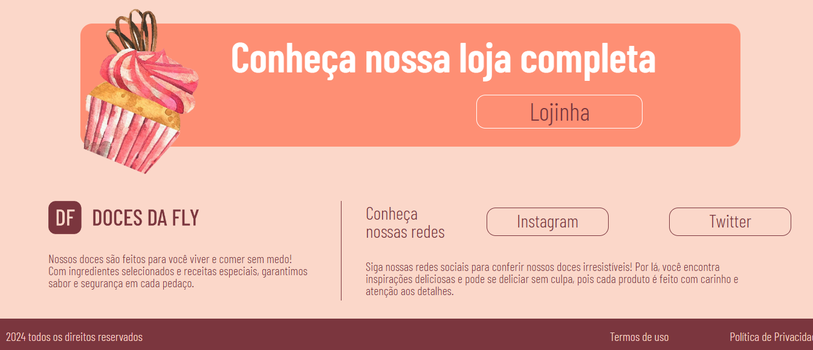
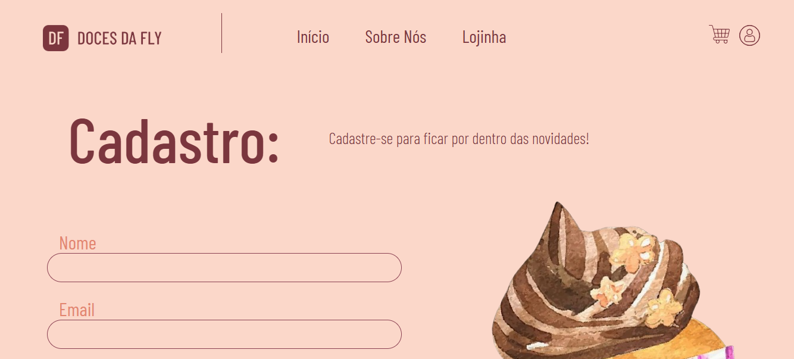
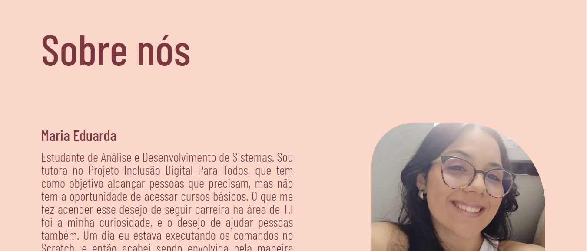

<h1 aligm ="center"> PROJETO WEB DOCERIA FLY</h1>

## Descrição
* Projeto de TCC do curso FLY - Mulheres In Tech com a proposta de desenvolver uma página web. 
Esta chamada "Doceria Fly" que tem o propósito de oferecer produtos acessíveis para pessoas com doenças celíacas. 

## Dependências

* Navegador Web;
*  VScode;
*  HTML 5;
*  CSS 3;
*  Javascript.

## Executando o Programa

* Baixe o repositório e execute com o seu VScode o LiveServer em localhost. 

## Ajuda
* Em caso da página web não funcionar, verificar extensões do VScode. 

## Autores
* Brenda Guerra;
* Kayane Barbosa;
* Maria Eduarda Miranda;
* Tâmara Falcão.
  
## Imagens do projeto

##

##

##

